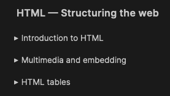
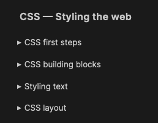

# Roadmap
Contains courses and material links for
- UI
  - HTML & CSS
  - js
  - react
  - angular

- Backend & Middleware
  - Node
  - Express/Fastify/NestJs
  - MySQL
  - MongoDb

## Pre-requisites
- Create a git repo and share the link to me. I will check the progress of your learnings by checking all the exercises you have done. For each exercise create a separate folder. For example, the directory structure can be like this:

> learn_UI
> - ex-1
> - ex-2
> - ex-learn-css

## UI
### HTML & CSS
- Go through/read the links content.Just learn the basics of HTML from:

  - [HTML Basics](https://developer.mozilla.org/en-US/docs/Learn/Getting_started_with_the_web/HTML_basics)

  - Read all the topics under the sub-headings as well [Learn HTML](https://developer.mozilla.org/en-US/docs/Learn/HTML)
  

  - Read all the topics under the sub-headings as well
  

  - Go through the whole site and also try to complete all the exercies in that site: https://internetingishard.netlify.app/

> By the end of this section, the following things should be learnt:
> - How to create a web page
> - How to link a webpage with external stylesheet
> - Selecting basic typography and how to load custom fonts
> - Basic types of layout in a website
> - Basics of float
> - Basics of flex
> - Basics of grid
> - When to use flex/grid and what is its advantage over float
> - Why don't we use table formats anymore
> - What is grid system?
> - What is responsive page design?

---

#### Exercise 1

- Create a clone of book my show webpage with all the learnt things.
- Use only HTML and CSS. No need to concentrate on any animations. Use only plain CSS.
- No SCSS or pre-processors or CSS frameworks like bootstrap or tailwind should be used.
- NOTE: You only need to create desktop version, no responsiveness is necessary

---

### CSS Frameworks:
- Check the web for the following questions:
  - Why CSS frameworks are necessary?
  - How to use it in a frontend project?
  - What's a 12 column grid system?
  - Learn Bootstrap/Tailwind latest version from the respective documentation
  - What is responsive page design

---

**Exercise 2**:

- Same as [Exercise 1](#exercise-1)
- Remove all css but instead use bootstrap/tailwind. Preferably use tailwind.
- Page should be responsive. Should be viewable from desktop large, laptop, tablet and mobile resolutions.

---
